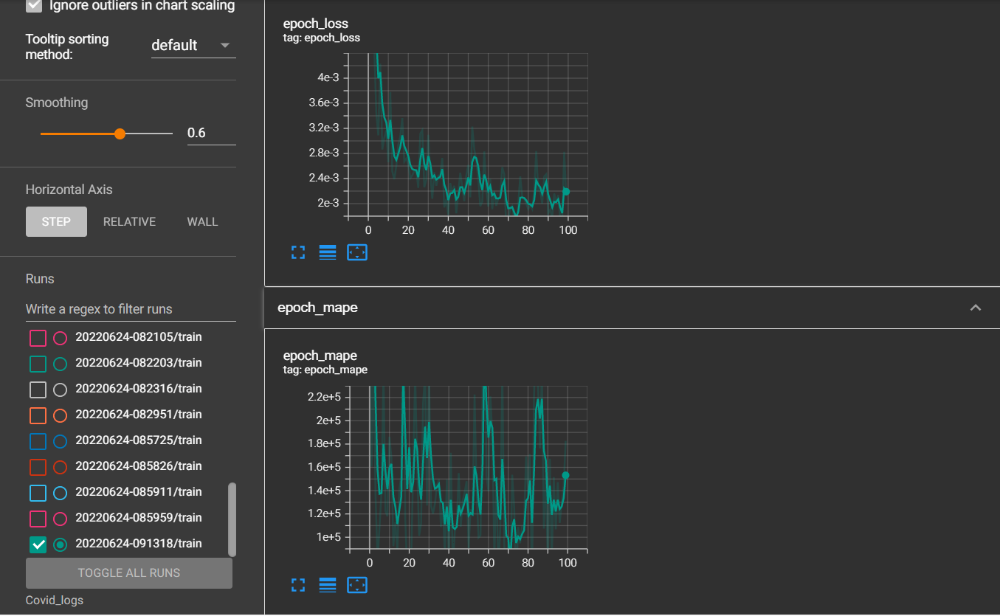

# covid-19-cases-prediction-using-LSTM
This project is about predicting a sequential data (time series).

We will be using "covid-19 cases in Malaysia" data to do following steps:

1) Data Loading      
2) Data Inspection
3) Data Cleaning
4) Preprocessing
5) Model Development
6) Model Evaluation

# Data Loading
to load our train and testing dataset in a dataframe

      df = pd.read_csv(DATA_PATH,na_values=[' ','?'])
      df_test = pd.read_csv(TESTING_PATH)
      target_column = ['cases_new']

# Data Inspection
To study our data type, description and to check if there's any duplicate or null in our data set

      df.info()
      df.describe().T

      eda = EDA() #this fucntion is in covid_prediction.py
      eda.plot_graph(df,target_column)

      print('number of null column ' + str(df[target_column].isna().sum()))

      print('number of duplicated ' + str(df.duplicated().sum()))

# Data Cleaning
- No duplicated data
- deal with 12 null values

      df[target_column] = df[target_column].interpolate()
      df=pd.DataFrame(df)

      df.info()

# Preprocessing
During this process, we will split our data into x and y.
The first x will be the daily new cases for day 1 until day 30 while the first y will be the number of new case during day 31. 
The second x will be the daily new cases for day 2 until day 31 and the second y will be the number of new cases during day 32.
and so will be for the rest of the data.

      mms = MinMaxScaler()
      df = mms.fit_transform(np.expand_dims(df['cases_new'],axis=-1))

      with open(OPEN_MMS_PATH,'wb') as file:
        pickle.dump(mms,file)

      X_train = [] 
      y_train = []

      win_size = 30

      for i in range(win_size,np.shape(df)[0]): 
        X_train.append(df[i-win_size:i,0]) 
        y_train.append(df[i,0]) 

      X_train = np.array(X_train)
      y_train = np.array(y_train)

# Model Development
Use LSTM layers, dropout, dense, input
The model is in covid_prediction_module.py

      md = ModelCreation()
      model = md.simple_lstm_layer(X_train)

      model.compile(optimizer='adam',loss='mse',metrics='mape')

      plot_model(model,to_file='model_plot.png',show_shapes=True,show_layer_names=True)

      # Callbacks
      tensorboard_callback = TensorBoard(log_dir=LOG_FOLDER_PATH)

      hist = model.fit(X_train,y_train,
                       epochs=100, batch_size=32, callbacks=[tensorboard_callback])
                 

below is our model architecture:

# Model Evaluation
during this step we will study and test our model using testing data to check the effectiveness of our model.

        test_df = pd.read_csv(TESTING_PATH,na_values=[' '])
        test_df.info()

        test_df = test_df['cases_new'].interpolate()
        test_df= pd.DataFrame(test_df)

        test_df = mms.transform(np.expand_dims(test_df['cases_new'],axis=-1))

        con_test = np.concatenate((df,test_df),axis=0)
        con_test = con_test[-(win_size+len(test_df)):]

        X_test = []
        for i in range(win_size,len(con_test)):
          X_test.append(con_test[i-win_size:i,0])

        X_test = np.array(X_test)

        predicted = model.predict(np.expand_dims(X_test,axis=-1))

        #%% plotting of graphs
        me = model_evaluation()
        me.plot_predicted_graph(test_df,predicted,mms)

        #%% MSE, MAPE
        print('mae:',mean_absolute_error(test_df,predicted))
        print('mse:',mean_squared_error(test_df,predicted))
        print('mape:',mean_absolute_percentage_error(test_df,predicted))

        test_df_inversed = mms.inverse_transform(test_df)
        predicted_inversed = mms.inverse_transform(predicted)

        print('mae_inversed:',mean_absolute_error(test_df_inversed,predicted_inversed))
        print('mse_inversed:',mean_squared_error(test_df_inversed,predicted_inversed))
        print('mape_inversed:',mean_absolute_percentage_error(test_df_inversed,
                                                              predicted_inversed))

            
below is our mae and mape score:

and here is our validation and training loss plot using tensorboard:

# Credit

1) Data set : [Here](https://github.com/MoH-Malaysia/covid19-public)
